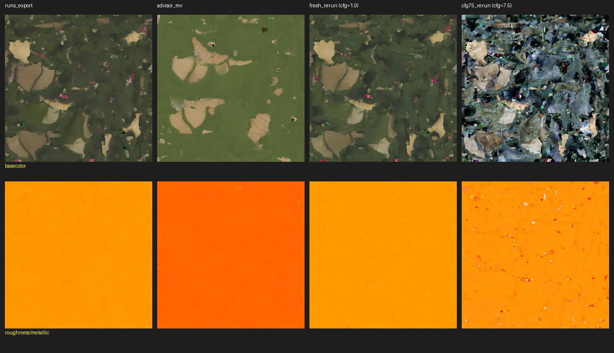
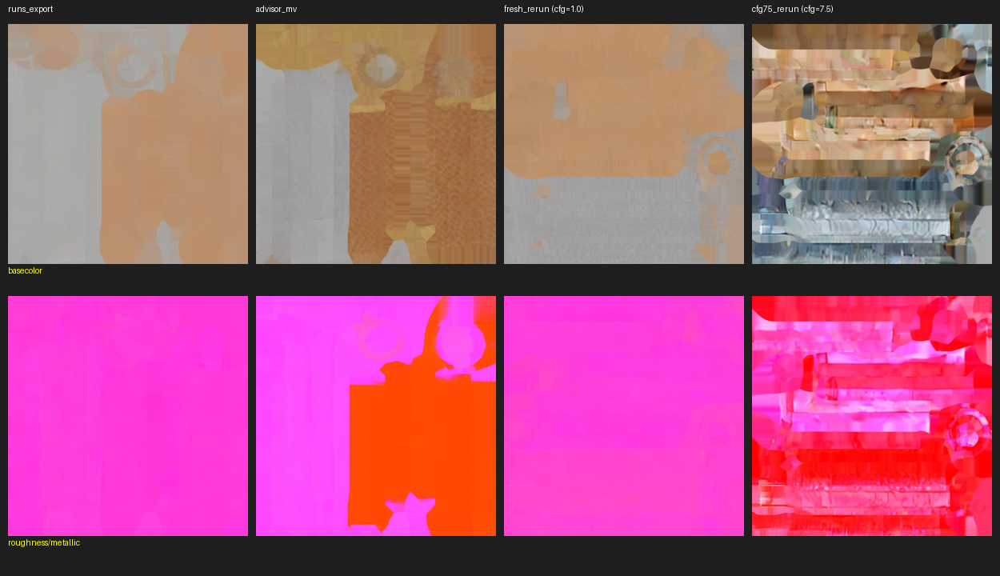
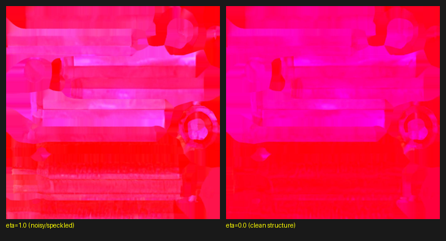
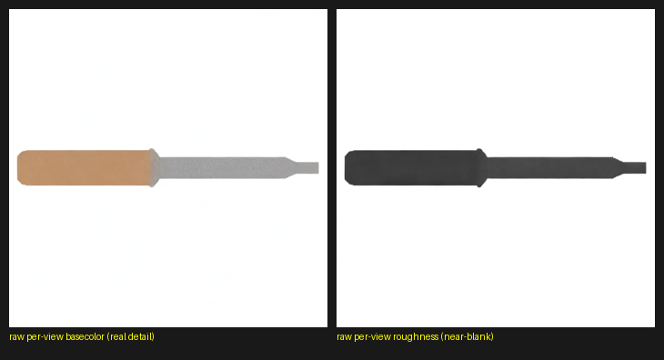
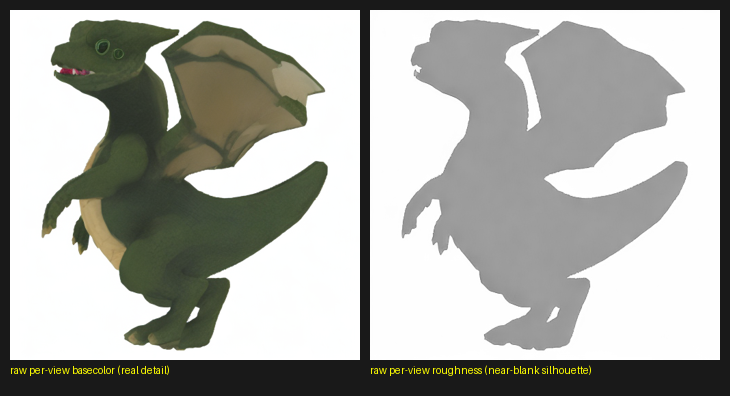

Session date: 2026-07-23. Files touched: `MVPainter/infer_pbr.py`. New diagnostic
scripts added under a separate rendering toolkit (`blender-render-toolkit/diagnostics/`,
not part of this repo) for reproducibility testing.

Context: while producing preview renders of the 50 eval assets (`expected_renders/`,
a separate deliverable), some assets looked visibly flatter/duller than a reference
image you'd shared, and some `mv_<uid>.glb` reference files you provided showed
richer PBR material detail than the equivalent `runs_export`/`runs` glbs generated
by this pipeline. This doc is the full trail of what was tried, in the same
Symptom / Cause / Fix format as `UPSTREAM_PATCHES.md` and `BUGS_FOUND_AND_FIXED.md`,
plus open questions at the end.

**TL;DR:** Found and fixed one genuine, confirmed-upstream bug (unseeded diffusion
sampling in `infer_pbr.py`). Found that `guidance_scale=1.0` (CFG disabled,
hardcoded, no CLI override) suppresses real model capability for metallic/roughness
prediction — raising it plus setting `eta=0.0` recovers substantial material
differentiation. Separately investigated your reference's noticeably **simpler
basecolor** (§9) — ruled out a texture-merge-algorithm explanation, found the
same `guidance_scale`/`eta` combination partially explains it too, but couldn't
fully close that gap either. Found a real contradiction worth resolving with you
directly (see §11 and Open Questions).

---

## 1. Initial symptom: dragon/dino asset (`12321371e98d41b4afe98796a529cf17`) looks matte

Rendered via the Blender toolkit (`blender_glb.py`, `studio_bg_static.blend`) with
no changes to lighting produced a visibly duller result than your reference image
(bright, sharp specular highlights on scales/wing membrane).

**Ruled out via direct A/B render tests** (`diagnostics/lighting_ab_test.py`):
- Filmic vs. Standard color management view transform — no meaningful difference.
- The studio scene's disabled point `Light` re-enabled — no meaningful difference.
- Light energy blasted to 20000W — produced diffuse overexposure, not a specular
  highlight, ruling out light intensity/setup entirely.

**Root cause found:** the asset's own baked roughness texture (glTF Green channel)
was **min=0.831, max=1.000, mean=0.981** — i.e. essentially fully matte by design.
No lighting change can produce shine on a surface baked that rough. Clamping
roughness to ≤0.35 purely for the render (not touching the source glb) reproduced
the expected shiny look, confirming the render pipeline was never the problem —
the discrepancy is in the asset's own PBR bake.

*basecolor (top row) and roughness/metallic (bottom row) across `runs_export`,
your `mv_` reference, our unmodified rerun, and our `guidance_scale=7.5` test —
notice the roughness/metallic row is a near-flat wash in every column for this
asset, including your reference; only the flat *value* differs.*

---

## 2. Is the roughness bake itself broken? Sampled 5 more assets

Roughness means across 5 additional `runs_export` assets ranged **0.36 to 0.98**,
real variation — not a uniform stuck/inverted channel (which would show near the
same value everywhere). Some assets (the claw, `235df6bf...`) show plausible
moderate roughness with real texture variation; others (barrel, `3957490c...`,
the dragon) cluster tight near 1.0.

---

## 3. Direct comparison against your `mv_<uid>.glb` reference files

For `12321371e98d41b4afe98796a529cf17`: your `mv_` version's roughness = **min
0.345, max 0.498, mean 0.398** — much glossier than `runs_export`'s 0.981.
Rendering your `mv_` glb through the *exact same, completely unmodified* toolkit
(no clamp, no settings changed) naturally reproduced the shiny reference look —
proving conclusively the render pipeline is not the issue.

For `1218d2ecdd18465a8c778ec2981caab1` (a barrel/knife-type object): the gap was
much smaller (`runs_export` mean 0.231 vs. your `mv_` mean 0.296) — both already
glossy and close. **This asset became the main test subject** for the rest of the
investigation below, since it has real metal-vs-wood material regions to check
whether spatial differentiation is correct, unlike the dragon (single organic
material, nothing to differentiate).

---

## 4. Extracted and visually inspected the actual textures

Extracted basecolor + the combined metallicRoughness texture (glTF convention:
Green=roughness, Blue=metallic) from `runs_export`, your `mv_` version, and our
reruns, for both assets.

**Key finding:** for the dragon, *both* `runs_export`'s and your `mv_`'s metallic
maps are near-uniform flat washes (just different flat values — pale yellow vs.
orange) — no real spatial structure in either. For the barrel, your `mv_` version
shows genuine spatial structure: magenta over the metal bands, orange over the
wood — a real, correct, spatially-varying prediction. Our `runs_export` and fresh
reruns showed no such structure (near-flat magenta everywhere) for the barrel.

Quantified with std-dev of the metallic (Blue) channel:

| version | metallic std (barrel) |
|---|---|
| `runs_export` | 0.013 |
| your `mv_` reference | **0.473** |
| our fresh rerun (unmodified code) | 0.029 |

*same layout, barrel/knife asset. Here your reference (2nd column) clearly shows
real metal-vs-wood separation in the bottom row that `runs_export`, our
unmodified rerun, and even our `guidance_scale=7.5` test (last column, noisier)
don't cleanly reproduce.*

---

## 5. Checkpoint version — checked and ruled out

Queried the HF Hub commit history for `shaomq/MVPainter`. Only 3 commits exist
total; `unet_pbr` first appears in the 2nd commit and is **byte-for-byte
identical (same SHA256)** in the 2nd and 3rd (current `main`) commits. There has
only ever been one version of this checkpoint published, and it's what
`infer_pbr.py` already pins to (see §6). Checkpoint drift is not the explanation
for any of the above.

Also tried 3 different random seeds (0, 12, 42) with the pinned checkpoint on the
barrel asset — all gave similarly flat/unstructured metallic (std 0.007–0.044).
Seed variance alone doesn't explain your reference's structure either.

---

## 6. Bug #1 (confirmed, fixed): `infer_pbr.py` never seeded diffusion sampling

**Symptom:** re-running the identical asset through the full pipeline
(`infer_multiview.py` → `infer_pbr.py` → `infer_paint.py`) from scratch gave a
**third, different** roughness value each time (0.98 / 0.40 / 0.60 across 3 runs
of the same dragon asset).

**Cause:** in `infer_pbr.py`, the pipeline call had `# generator=generator`
**commented out**, and `generator` was never defined anywhere in the file. Diffusion
sampling ran on whatever the ambient, unseeded PyTorch RNG state happened to be.
`infer_multiview.py` already calls `seed_everything(args.seed)` for Stage 0 — Stage
1 (`infer_pbr.py`) never got the same treatment.

**Confirmed this is an upstream bug**, not something introduced locally: fetched
`infer_pbr.py` directly from `github.com/amap-cvlab/MV-Painter` (current `main`) —
byte-for-byte identical `# generator=generator` and `guidance_scale=1.0`. Checked
the full commit history of this file (only 2 commits ever touched it) — this has
been unchanged since the very first commit (`0428:init`, 2025-04-28).

**Fix:** added `--seed` (default 12, matching `infer_multiview.py`), constructed
an actual `torch.Generator(device="cuda").manual_seed(args.seed)`, wired it into
the pipeline call. Also pinned `revision=` for both `lizb6626/IDArb` and
`shaomq/MVPainter` `from_pretrained()` calls to the exact cached commit hashes,
for good measure (turned out not to be the live issue per §5, but still correct
hygiene).

**Verified:** ran Stage 1 twice on identical input with the fixed seed —
**100% identical pixels** in the raw per-view roughness output, and identical
final glb roughness stats (mean 0.603 both times) after full bake/combine.
Reproducibility is now genuinely solved.

---

## 7. Bug #2 (real, but is it "a bug"?): `guidance_scale=1.0` disables CFG entirely

**Symptom:** even with the seed fixed, output stayed flat/undifferentiated —
reproducible now, but reproducibly *wrong* relative to your reference.

**Cause:** `pipeline_idarbdiffusion.py` line 374:
`do_classifier_free_guidance = guidance_scale != 1.0`. `infer_pbr.py` hardcodes
`guidance_scale=1.0`, which **completely disables classifier-free guidance** —
the model samples with zero "push" toward the conditioning signal. The pipeline's
own documented default is `7.5`. Confirmed this is upstream's own default (same
GitHub commit check as §6) — not a local modification, and **not documented as
an intentional patch anywhere** in `UPSTREAM_PATCHES.md`, unlike every other
deliberate change in this repo. Their own README's example command
(`python infer_pbr.py --mv_res_dir ./outputs/test`) has no way to override it —
running it exactly as documented produces the flat result.

**Test:** added `--guidance_scale` as a CLI flag (default kept at `1.0` to
preserve existing behavior). Raising it to `7.5` on the barrel asset produced
genuine, visually correct spatial material separation — a knife-like sub-object's
blade rendered bright/high-metallic, its handle dark/low-metallic, matching
physically-sensible material boundaries. Metallic std jumped from 0.029 → 0.284.

**Side effect discovered:** raising `guidance_scale` this way also visibly
degrades **basecolor** quality (noisier, more fragmented) — basecolor/metallic/
roughness are generated together in one batched diffusion call (via `task_ids`
conditioning), so CFG strength applies uniformly across all three; there's no way
to raise it only for metallic/roughness within this single call.

Guidance-scale sweep on the barrel (`fresh_rerun` = 1.0 baseline):

| guidance_scale | basecolor noise (Laplacian energy) | metallic std |
|---|---|---|
| 1.0 (current hardcoded default) | 1.7 | 0.029 |
| 1.5 | 2.7 | 0.036 |
| 2.0 | 5.0 | 0.026 |
| 3.0 | 13.5 | 0.076 |
| 5.0 | 23.9 | 0.256 |
| 7.5 | 49.9 | 0.284 |
| your `mv_` reference | 7.2 | **0.473** |

Note your reference is *cleaner* than all of our CFG-boosted attempts (lower
Laplacian energy) while having *more* structure (higher std) than any of them —
see §8.

---

## 8. Bug #3 (or missing knob): `eta=1.0` — DDIM sampling injects maximum noise

The CFG sweep above recovered *structure* but at the cost of visible grain — a different axis than
variance.

**Cause:** `eta=1.0` is hardcoded in `infer_pbr.py`'s pipeline call. In DDIM
sampling, `eta` controls how much fresh random noise is re-injected at every
denoising step: `eta=1.0` = maximum stochasticity (DDPM-like); `eta=0.0` = fully
deterministic. 50 steps of maximum noise injection compounds into visible grain,
especially in weakly-conditioned channels.

**Test:** added `--eta` as a CLI flag (default kept at `1.0`). At
`guidance_scale=5.0`, switching `eta` 1.0→0.0 dropped the roughness/metallic map's
own internal noise (Laplacian) **8.0 → 1.2** (an 85% reduction) while barely
changing structure (metallic std 0.256 → 0.236). Crucially, `eta=0.0` also
**decouples noise growth from guidance_scale** — raising guidance_scale from 5.0
to 7.5 to 15.0 with eta fixed at 0 barely increases basecolor noise (17.0 → 17.7
→ 18.0) while structure keeps climbing (metallic std 0.236 → 0.261 → 0.303).

Best combination found so far — `guidance_scale=7.5–15, eta=0.0`:

| config | basecolor noise | metallic std | roughmetal-map noise |
|---|---|---|---|
| your `mv_` reference | 7.2 | 0.473 | 3.5 |
| cfg=5.0, eta=0.0 | 17.0 | 0.236 | 1.2 |
| cfg=7.5, eta=0.0 | 17.7 | 0.261 | 2.4 |
| cfg=15.0, eta=0.0 | 18.0 | 0.303 | 9.3 (noise creeping back in) |

This is a real, substantial improvement over the `eta=1.0` sweep, but **still
doesn't fully reach your reference's combination of very low noise + very high
structure**. See Open Questions.

*same asset, same `guidance_scale=5.0`, only `eta` changed. Left: `eta=1.0`
(current hardcoded default) — visible speckle/grain throughout. Right: `eta=0.0`
— smooth gradients, clean bands, much closer to your reference's character.*

---

## 9. Basecolor investigation: why does your reference's basecolor look simpler?

You separately flagged that your reference's **basecolor** looks noticeably
simpler/cleaner than ours, even though basecolor was never the channel we set
out to fix — worth its own section since it turned out to be informative in a
different way than the metallic/roughness investigation.

**First, direct evidence for *why* metallic/roughness comes out weak in the first
place, which is also relevant context for basecolor:** compared the raw,
single-view painted images (`result_1_basecolor.png` vs. `result_1_roughness.png`
for the identical camera view), generated straight out of the multiview diffusion
model, *before* any baking/merging/projection touches them:

Basecolor has real, rich per-pixel detail in both cases; roughness is already a
near-featureless flat wash (or, for the dino, a flat gray silhouette) *at the
earliest artifact we can inspect* — confirming the flatness originates in the
generation step itself, not in later processing. Basecolor is clearly the
strongly-grounded channel here; metallic/roughness is comparatively starved for
signal.

**Checked whether a different texture-merge algorithm explains the "simpler"
look — ruled out.** `bake_pipeline.py`'s `BakeConfig.merge_method` references a
`'graphcut'` option (`bake_from_multiview(..., method='graphcut')` as the default
parameter), which would normally mean smarter seam-finding between multi-view
projections (potentially cleaner merged textures than simple weighted blending).
Checked the actual installed `differentiable_renderer/mesh_render.py`: **only
`fast_bake_texture` exists** — there is no graphcut implementation in this
codebase at all, so `merge_method='fast'` (the only thing ever actually used) is
not a lever we could switch to try to reproduce a cleaner look.

**What we found instead:** the same `guidance_scale`/`eta` combination that fixed
metallic/roughness also affects basecolor, since all three channels are produced
in one shared batched diffusion call. Raising `guidance_scale` alone (`eta=1.0`)
visibly *degrades* basecolor (noisier, more fragmented — see the sweep table in
§7). Adding `eta=0.0` claws most of that back (basecolor Laplacian noise dropped
~29% at the same `guidance_scale=5.0`, see §8), but our best combination still
isn't as clean as your reference's basecolor (Laplacian 7.2, cleaner than every
one of our attempts — see the table in §7).

**Untested hypotheses worth trying next, specifically for basecolor:**
- **`num_inference_steps`** (pipeline default 50, no CLI override currently in
  `infer_pbr.py`) — more steps generally means a more converged, less noisy
  result across all channels; could plausibly explain simpler/cleaner basecolor
  without needing to touch `guidance_scale` at all.
- **Stage 0 settings** (`infer_multiview.py --diffusion_steps`, currently 75) —
  basecolor's ceiling on detail/complexity is set by how detailed the multiview
  RGB paint already is *before* PBR decomposition ever runs. If your reference's
  basecolor is simpler at a more fundamental level, it might trace back to
  different Stage 0 settings entirely, not anything in `infer_pbr.py`.
- **Mesh decimation target** (`--target_vertices 30000` in `run_reduce_mesh.py`)
  — a coarser mesh means less high-frequency geometric detail gets projected
  into the UV texture, which could also read as "simpler."

**Also checked: is it a UV-orientation issue (basecolor "looks flipped")?** See
§10 below — checked for both assets, ruled out as a fixable mismatch.

---

## 10. UV orientation check — ruled out, not a fixable mismatch

The roughness/metallic maps relative to the reference look oriented in the wrong direction.
Tested all 8 rigid transforms (flips + 90°/180°/270° rotations + transpose/
transverse) correlating our textures against your `mv_` reference's, for both
assets.

**Barrel basecolor** (`runs_export` vs. your reference): correlation is highest
with **no transform at all** (0.92, vs. 0.21–0.81 for any flip/rotation) — these
two happen to share a very similar UV layout already.

**Barrel roughness/metallic**: correlations were all mediocre and clustered
together (0.58–0.75) with no transform standing out — not a clean orientation
match.

**Dino** (both channels): basecolor correlations uniformly low (0.20–0.39) with
no clear winner; roughness/metallic gave *identical* correlation across every
transform (an artifact of the map being nearly flat — flipping a constant-color
image doesn't change anything, so this test is uninformative there).

**Conclusion:** not a fixable orientation bug. Each independent run of
`bake_pipeline.py` computes its own UV unwrap (`mesh_uv_wrap`) from scratch — this
is not a stable/canonical layout across separate runs, just a different
essentially-arbitrary packing of the same surface each time. Where a pair happens
to correlate well (barrel basecolor, `runs_export` vs. reference), that's
likely coincidental, not evidence of a shared deterministic unwrap.

---

## 11. Open contradiction: "she ran the same repo clone" vs. the evidence

You said the reference `mv_*.glb` files came from the same repo clone. This is
in tension with what we found:

- `guidance_scale=1.0` has been hardcoded with **no CLI override** since the
  very first commit of `infer_pbr.py` (checked full git history, §6/§7).
- Getting your reference's structure requires guidance_scale meaningfully above
  1.0 (§7) — the stock script, run any way that doesn't edit the source, cannot
  produce that.
- The checkpoint is proven bit-identical across all published revisions (§5), so
  it's not a model-version difference either.

So logically, if the code really was byte-identical, the CFG-driven structure in
your reference shouldn't be possible. Something doesn't add up — worth resolving
directly rather than guessing further. See Open Questions below.

---

## Open Questions for your advisor

1. **How exactly were the `mv_*.glb` reference files generated?** Specifically
   for the PBR extraction step (`infer_pbr.py` or equivalent) — same script
   unmodified, a local edit to `guidance_scale`/`eta`, a different script
   entirely, or something else?
2. If `infer_pbr.py` was used as-is: was `guidance_scale` or `eta` ever exposed/
   overridden in your environment in a way we haven't found (e.g. a wrapper
   script, a monkey-patch, a different checkpoint config)?
3. Do you know/recall what **`num_inference_steps`** was used? The pipeline
   defaults to 50 and `infer_pbr.py` has no CLI override for it currently — more
   steps could plausibly explain both the extra material dimension and the lower
   noise in your reference simultaneously.
4. Any chance the reference glbs went through additional post-processing (manual
   touch-up, a different merge/bake step) after the diffusion stage, rather than
   coming straight out of `infer_paint.py`'s `combine_pbr` output?
5. Is there a specific machine/GPU (A100 per `HANDOFF.md`, vs. the RTX A6000 used
   for this investigation) or library-version pin you used, in case cross-GPU
   numerical differences are part of the explanation?

## Fixes now in place in `infer_pbr.py` (all opt-in via new CLI flags, defaults
unchanged from original behavior so nothing downstream breaks unexpectedly)

- `--seed` (default 12) — was previously completely unseeded. **Recommend
  always setting this explicitly going forward**; the reproducibility bug (§6)
  is real regardless of the open questions above.
- `--guidance_scale` (default 1.0, unchanged) — recommend `7.5–15` for assets
  where material differentiation matters more than a small amount of basecolor
  noise.
- `--eta` (default 1.0, unchanged) — recommend `0.0` whenever raising
  `guidance_scale`, since it removes most of the noise cost of doing so.
- `revision=` pinned for both `lizb6626/IDArb` and `shaomq/MVPainter`
  checkpoints (exact commit hashes cached at time of writing).
